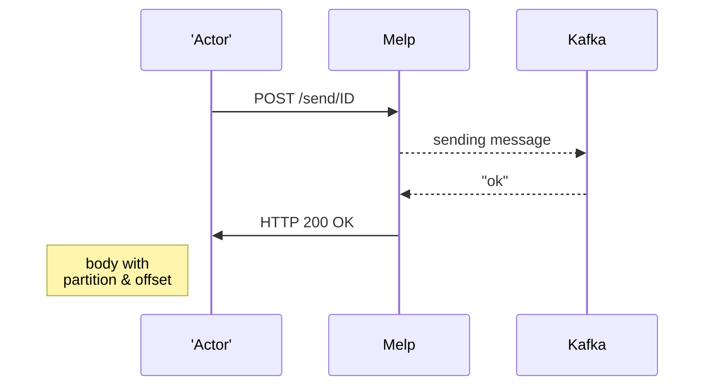
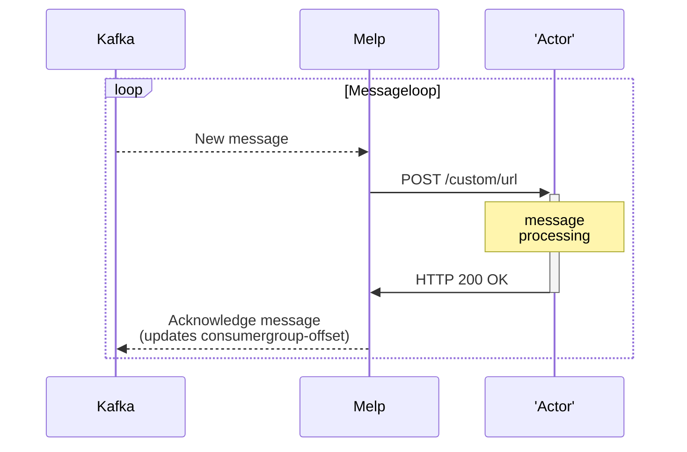

# melp
A Message Helper to proxy between messages and REST-APIs

Details on the configuration can be found [here](./docs/CONFIG.md)

### Example usages:
* sidecar in Kubernetes
* standalond proxy between Kafka and a REST-API

## Commandline-arguments
| Argument | Env | Description | Default | Limits |
| --- | --- | --- | --- | --- |
| --file FILE               | CONFIG           | File to read configuration from | melp.yaml | |
| --port PORT               | HTTP_PORT        | Port to listen on               | 10000     | |
| --reconnect-delay DELAY   | RECONNECT_DELAY  | Delay between reconnects        | 10s       | 1s .. 2m|
| --reconnect-jitter JITTER | RECONNECT_JITTER | Randomize reconnect-delay       | 2s        | 0 .. _reconnect-delay_ |
| --log-level LEVEL         | LOGLEVEL         | Log-level to use                | -         | |
| --relax                   | RELAX            | Relax the config-format         | false     | |
| --allow-stop              | ALLOW_STOP       | Allow stop of melp              | false     | |

> **NOTE:** Arguments will override environment-variables

## Send message using REST-API (output)

This setup is when the `Actor` is unable to directly talk to the desired messaging system (firewall or 3rd-party product are common scenarions).

With this setup the `actor` can instead do a HTTP POST to `melp` which will translate that into an actual message to the message-broker.

```sh
curl --request POST \
  --url 'http://HOSTNAME/send/ID' \
  --header 'Authorization: Bearer YOUR_BEARER_TOKEN' \
  --header 'Content-Type: application/json' \
  --data '{"data":"text"}'
```



Example of response:
```
HTTP/1.1 200 OK
Content-Length: 29
Content-Type: application/json; charset=utf-8

{
  "partition": 0,
  "offset": 3320
}
```
> **NOTE 1:** each call is a syncronous call, so the actor will only get a response once the message has been sent to the message-broker
> 
> **NOTE 2:** You (the 'Actor') can call the /send/.. in paralell, and each call will be processed (order is not guaranteed)

### Headers
The following HTTP-headers are passed through to the message-broker:
* Content-Type
* Content-Encoding
* Content-Disposition
* Content-Language
* Content-Range
* ETag
* Expires
* X-Request-Id & X-Correlation-Id
* Traceparent & Tracestate
* Melp-* (the 'Melp-' prefix is stripped)


[More information..](./docs/REST-API.md)

## Receive message (like a webhook)


### Example of request 
```
HTTP/1.1 POST /callback/dev-tstest-atest-v2
Content-Length   : 15
Melp-Offset      : 3320
Melp-Partition   : 0
Melp-Topic       : my-topic-name-to-read

{"data":"text"}
```

> **NOTE:** each new message is processed syncronously, so the message-broker will not send a new message until the previous message has been processed

### Processing rules
* Any HTTP-statuscode (200..299) is considered a success, and the message will be acknowledged (consumergroup-offset will be updated)
* Connection errors or HTTP 5xx (except 501) will be retried (with exponential backoff)
* Any error or non 2xx-status will cause a reconnection (to enable/ensure we get the same message again),<br/> thus the only way to move forward in the message-stream is to return a HTTP 2xx

### Headers
You will get all headers that the message contains, plus the following headers:
| Header            | Description                                 |
| ----------------- | ------------------------------------------- |
| Melp-Topic        | The topic the message was read from         |
| Melp-Partition    | The partition the message was read from     |
| Melp-Offset       | The offset the message was read from        |

## Multiple Partitions
When using multiple partitions on a topic it is usually a good idea to have a partitionkey that is used to ensure that messages with the same key always end up on the same partition.

This is solved using the HTTP-header "_Melp-PartitionKey_"<br/>
Just set this header to the value you want to use as partitionkey, and Kafka will ensure that all messages with the same key will end up on the same partition.
_(If you don't set this header, then Kafka will use a random partition)_

If a PartitionKey is used, then the callback will add that header to the request.
