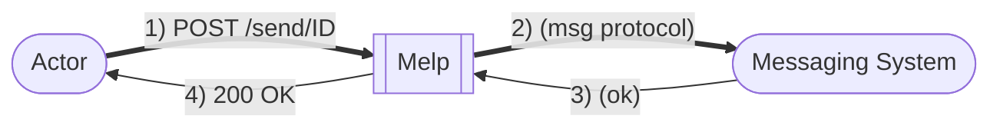
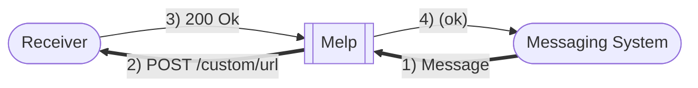

# melp
A Message Helper to proxy between messages and REST-APIs

Please check out the usage-guide with [REST-API](./REST-API.md) examples

## Send message using REST-API (output)

This setup is when the `Actor` is unable to directly talk to the desired messaging system (firewall or 3rd-party product are common scenarions).

With this setup the `actor` can instead do a HTTP POST to `melp` which will translate that into an actual message to the message-broker.

[More information..](./docs/REST-API.md)

## Receive message (like a webhook)

    